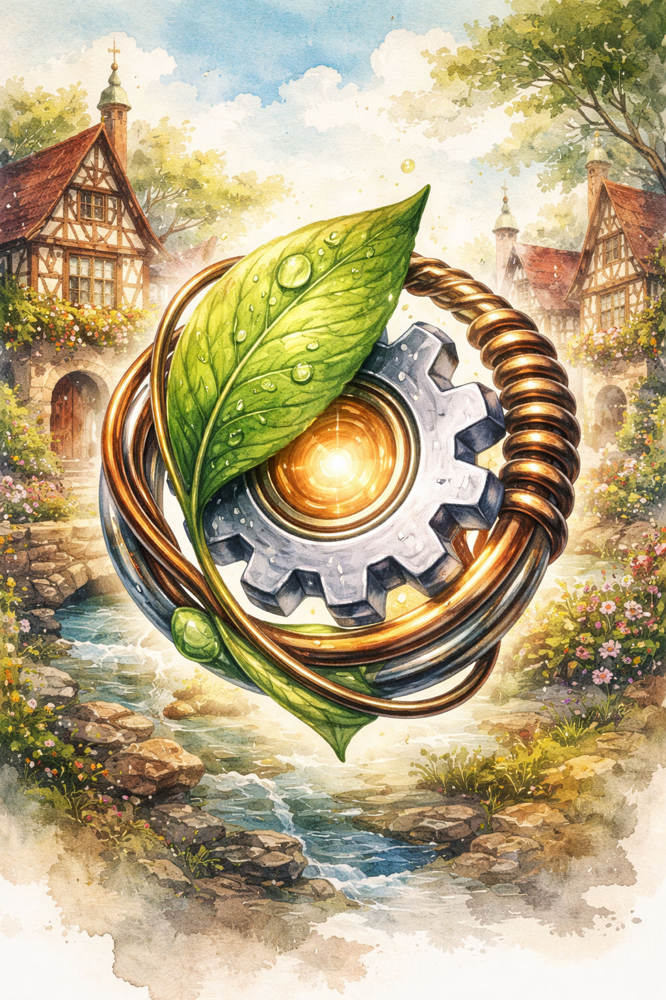

    
    <h1 align="center">LeafSpringCog</h1>

LeafSpringCog is a fork of LandSandBoat, with small code changes tuned for the [Rheinland-Pfalz](https://github.com/claybie/rheinland-pfalz) server.

Visit the LandSandBoat [project page](https://github.com/LandSandBoat/server/) for more info. LeafSpringCog is licensed under [GNU GPL v3](https://github.com/LandSandBoat/server/blob/base/LICENSE).

Join the official [Rheinland-Pfalz discord](https://discord.gg/BWBhVq9hKB) for server updates, support, guides and more.

Join the [FFXiPrivateServers discord](https://discord.gg/THnWnC9fjr) server for information on LandSandBoat development and other private servers.
